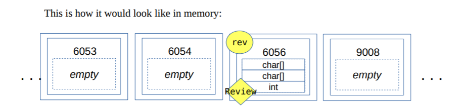
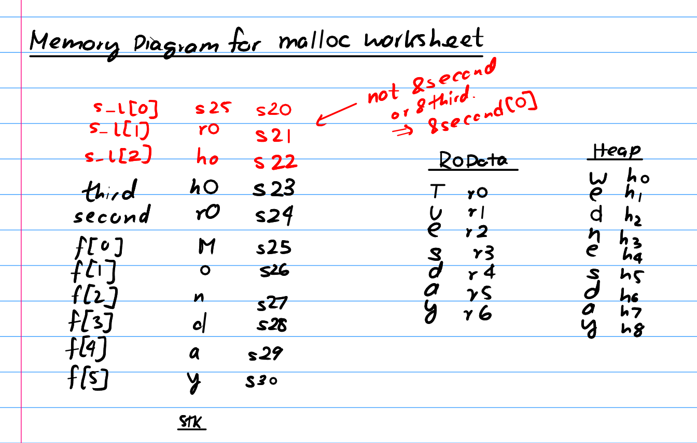

---
title:
- CSCB09 Midterm Review 
author:
- github.com/tabeebyeamin/AMACSS
theme:
- Copenhagen
date:
- February 18, 2020
---

# Agenda

+ Unix Commands & File System
+ C: Arrays, Pointers
+ C: Dynamic Memory Allocation
+ C: Makefiles


# Unix commands
- **pwd**: print working directory
- **ls *[dir]***: show files in current directory or *dir* if specified
- **cd *dir***: change working directory to *dir*
    - special symbols: ~, ., ..
- **cat or more *file***: show contents of *file*
- **cp, mv *[loc1]* *[loc2]***: copies or moves file/directoy from loc1 to loc2
- **rm *[-r]* *file***: remove file or directoy (-r lets your delete nonempty)
- **mkdir *[dir]***: create directory

# More Useful Commands
- **grep *[regex]***: globally search regex and print
- **chmod**: change access permissions (r,w,x) *chmod 644 text*
- **who**: displays users logged in right now
- **sort**: sorts a collection of data *sort -k4 text*
- **wc**:  word count *wc -l*


# File
- Name, owner, size, perms, 
- Ls -l or stat to get info on a file
- Implemented in a data structure called inode: has inode number, unix maintains inode to disk location

## Directory
- Collection of files
- Every directory is a file itself
- Directory hierarchy is an acyclic graph, not a tree

# Hard Links & SoftLinks
## Hardlink
`ln /Alice/ex1.c /Bob/ex1.c`

- If ex1.c is removed, the directory entry gets removed, but the file itself is only removed if it no longer has any name/hard links

## Softlink
`Ln -s /Alice/ex1.c /Bob/ex1.c`

- If /Alice/ex1.c is removed, the directory entry gets removed, and /Bob/ex1.c will be left with *dangling pointer*

# Permissions

Each file has read write an execute permissions for  owning user, group and others

`rwxrwxrwx`

- first 3 refer to User perms, second 3 to Group, last 3 refer to Others

By default

`rwxr-xr-x` 

- chmod u+x fname: give user execute perms
- chmod g-r fname: remove read perms from users in group
- chmod a+rwx fname: all users all perms

# 
C and stuff

# Arrays

```c
int array[4] = {1,2,3,4};
char string[6] = "CSCB09";
```


- Contiguous chunk of memory, list of items with the same type
- Size of array not stored in the array
- Exceed array bounds causes undefined behaviour
- Allocates in the stack from top down

# Pointers:
- Stores memory addresses of variables
- Is allocated in the **stack** just like any variable

```c
int *ptr;
```

## Pointer Arithmetic
```c
x[i] == *(x + i);
```

- Respects the type of the pointer
    - if you had int pointer `ptr` and did `*(ptr + 1)`, you would increment 4 bytes in memory instead of one to get to the next int box

# August 2017 Question 2a)

```c
    int a[4] = {0, 1, 2, 3};
    int b = 1;
    int *p = a;
    p = p + b;
    b++;
    *p += b;
    p = p + b;
    *p += 2;
    p--;
    *p *= 4;
    p = p - b;
    *p = p - a;
```
What is `a[0]` `a[1]` `a[2]` and `a[3]`?

# August 2017 Question 2a)

```c
    int a[4] = {0, 1, 2, 3};
    int b = 1;
    int *p = a;
    p = p + b;
    b++;
    *p += b;
    p = p + b;
    *p += 2;
    p--;
    *p *= 4;
    p = p - b;
    *p = p - a;
```
`a[0] = 0`,  `a[1] = 3` `a[2] = 8` and `a[3] = 5`


  
# Allocating memory on demand 
```C
malloc(# of items*size of each item in bytes)
```
- Finds available place in memory that has the request capacity, reserves it, and returns a pointer to the reserved chunk

```C
Node *newNode = (Node *)malloc(sizeof(Node));
```
- dynamically allocated memory is allocated on the **heap**
- malloc returns pointer without any attached data type so you have to cast it
- always release (**free**) all the memory you  allocated, or you could have memory leaks

# Memory Allocation Question

August 2017 Question 2c) (too big to put on the slide)


# Structs

```c
typedef struct a_name_for_struct
{
    char *string_field;
    int *int_field;
}  new_type;
```

## How to use them?
+ Declare a variable: 
```c
new_type  v;
```
+ Access a field: 
```c
v.int_field = 10;
```

+ Pass them or return them from a function:
```c
new_type update_values(new_type v, int value);
```

# In the memory model


+ ONE chubby box, inside that box are all the components of the struct
+ It's NOT an array, but you can put an array inside a struct
+ Passing a struct variable to a function makes a copy!
+ Returning a struct variable from a function also makes a copy!
+ Lots of data traffic this way, so we prefer using pointers

# Using pointers for structs

```c
typedef   struct  a_name_for_struct
{
   int field_name;
} new_type;
```

## Using pointers means

+ accessing fields with the -> operator

```c
new_type  v;
new_type  *vp;
vp=&v;
vp->field_name=value;
```
+ dynamically allocating in the heap

```c
new_type v2 = (new_type *)malloc(sizeof(new_type));
```

# August 2017 Question 4, (Also May 2017 Question 2c)
```C
struct student {
    int age;
    char *name;
}
// Increase the age of a student by amt.
void increase_age(struct student s, int amt) {
    s.age += amt;
}
int main() {
    struct student rob;
    rob.age = 10;
    increase_age(rob, 5);
    printf("%d should be 15\n", rob.age);
}
```
- Does this code do what it's supposed to?

# August 2017 Question 4, (Also May 2017 Question 2c)
```C
struct student {
    int age;
    char *name;
}
// Increase the age of a student by amt.
void increase_age(struct student s, int amt) {
    s.age += amt;
}
int main() {
    struct student rob;
    rob.age = 10;
    increase_age(rob, 5);
    printf("%d should be 15\n", rob.age);
}
```
- We are changing a copy of rob, original stays the same


# Memory Model Review
- Memory for a process is called its address space
- Memory is a sequence of bytes
- Memory location is identifiable by an address
- Variables, pointers, function frames go in the **stack**
    - bottom-up
- Dynamically allocated memory (malloc) goes in the **heap**
    - top-down
- String literals go in **read-only data** (cannot be changed!)
- Global variables outside of functions go in **static data**

# Memory Model Worksheet Review
Write a program that declares 3 strings. The first named first should be set to the value "Monday", and be
stored on the stack frame for main. second should be a string literal with the value "Tuesday". third should
have value "Wednesday" and be on the heap. The pointers for second and third will be in stack frame for main.

# Memory Model Worksheet Review
Write a program that declares 3 strings. The first named first should be set to the value "Monday", and be
stored on the stack frame for main. second should be a string literal with the value "Tuesday". third should
have value "Wednesday" and be on the heap. The pointers for second and third will be in stack frame for main.

```c
char first[6] = "Monday";
char *second = "Tuesday";
char *third = malloc(9*sizeof(char));
strcpy(third, "Wednesday");
```

# Memory Model Worksheet Review
Add to your program so that it declares an array string list of 3 pointers to char and point the elements to
first, second, and third, respectively. So now you have an array of strings. Where is the memory allocated
for this array?


```c
char first[6] = "Monday";
char *second = "Tuesday";
char *third = malloc(9*sizeof(char));
strcpy(third, "Wednesday");
```

# Memory Model Worksheet Review
Add to your program so that it declares an array string list of 3 pointers to char and point the elements to
first, second, and third, respectively. So now you have an array of strings. Where is the memory allocated
for this array?


```c
char first[6] = "Monday";
char *second = "Tuesday";
char *third = malloc(9*sizeof(char));
strcpy(third, "Wednesday");

char *string_list[3];
string_list[0] = first;
string_list[1] = second;
string_list[2] = third;
```
Memory for the array is located in the stack, in the frame for the function. **Note:** we can modify strings at index 0 and 2, but not 1.

# Memory Model Worksheet Review
Draw the memory model for the program

```c
char first[6] = "Monday";
char *second = "Tuesday";
char *third = malloc(9*sizeof(char));
strcpy(third, "Wednesday");

char *string_list[3];
string_list[0] = first;
string_list[1] = second;
string_list[2] = third;
```

# Memory Model Worksheet Review



# Makefiles
- Manually calling gcc is not scalable for large number of files

```make
myprogram: file1.c
    gcc -Wall -o myprogram file1.c
```
- have a file titled `make` and create rules inside it like above

# Makefiles
- You can use the following patterns to represent target, all prereqs, first prereq and outdate prereqs

```make
myprogram: file1.c file2.c
    gcc -Wall -o myprogram file1.c
```
- `$@`: myprogram
- `$^`: file1.c file2.c
- `$<`: file1.c 
- `$?`: outdated prereqs

# Makefile Worksheet Review

```make
dinner: pizza salad
pizza: cheese topping.peppers
	echo making pizza
	cat cheese topping.peppers > pizza
cheese: 
	echo gooey cheese > cheese
topping.%:
	echo yummy $@ > $@
salad: 
	echo salad is healthy
```
- `cheese` is already created. Sequentially run the following and give **console output** and **files modified** for:
    - make salad
    - make pizza
    - make dinner

# Makefile Worksheet Review
**make salad** outputs

- echo salad is healthy
- salad is healthy  

**make pizza** modifies `topping.peppers` and `pizza` and outputs

- echo yummy topping.peppers > topping.peppers
- echo making pizza
- making pizza   
- cat cheese topping.peppers > pizza

**make dinner** outputs

- echo salad is healthy
- salad is healthy   


# Additional Topics of Study
- Familiarize yourself with string libraries (str[n]cmp, str[n]cpy, str[n]cat)
- Familiarize yourself with input scanning functions (scanf, fgets etc.)
- Do Bianca's past papers in the exam repo:
    - August 2017 Questions 1f), 2, 3, 5, all of 4 except forks and signal questions
    - May 2017 Questions 1, 4 and maybe 2